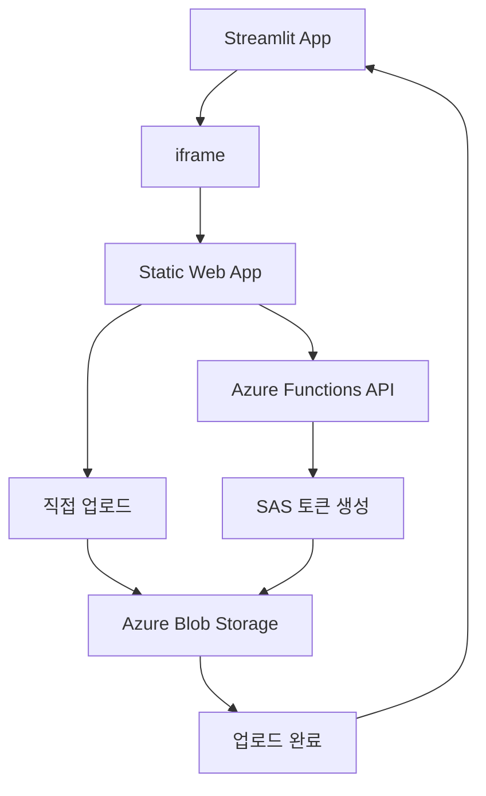

# 🚀 Azure File Uploader for Streamlit

**Streamlit**에서 **iframe**으로 사용할 수 있는 **Azure Blob Storage** 대용량 파일 업로드 서비스입니다.

[](https://azure.microsoft.com/services/app-service/static/)
[](https://azure.microsoft.com/services/functions/)
[](https://nodejs.org/)

## ✨ 주요 기능

### 🎯 **대용량 파일 지원**
- **스마트 업로드**: 100MB 미만은 단일 업로드, 이상은 청크 업로드
- **청크 업로드**: 4MB 블록 단위로 분할하여 안정적인 대용량 파일 처리
- **동시 업로드**: 최대 5개 블록을 동시에 업로드하여 속도 향상
- **무제한 크기**: Azure Blob Storage를 통한 TB급 파일 지원

### 🔄 **실시간 진행률**
- 업로드 진행상황을 실시간으로 표시
- 업로드된 바이트 수와 전체 크기 표시
- 네트워크 오류 시 자동 재시도

### 🔗 **Streamlit 완벽 통합**
- iframe으로 간편한 임베딩
- 업로드 완료 시 자동으로 Streamlit에 완료 신호 전송
- URL 파라미터를 통한 동적 컨테이너 설정

### 🎨 **직관적인 UI**
- 드래그 앤 드롭 파일 선택
- 반응형 디자인으로 모든 디바이스 지원
- 아름다운 모던 UI

## 📋 사용 방법

### 1. **Streamlit에서 사용**

```python
import streamlit as st

# 컨테이너 설정
container_name = "my-dataset"
location = "eastus"

# 업로더 URL 생성
uploader_url = f"https://your-app.azurestaticapps.net?container={container_name}&location={location}"

# iframe으로 임베딩
st.title("파일 업로드")
st.components.v1.iframe(uploader_url, height=600, scrolling=True)

# 업로드 완료 처리
if "upload_complete" in st.session_state:
    st.success(f"✅ 파일 '{st.session_state.upload_complete}' 업로드 완료!")
```

### 2. **URL 파라미터**

| 파라미터 | 설명 | 예시 |
|---------|------|------|
| `container` | Azure Blob Storage 컨테이너 이름 | `uploads` |
| `location` | Azure 지역 | `eastus`, `westus2`, `koreacentral` |

**예시 URL:**
```
https://your-app.azurestaticapps.net?container=datasets&location=eastus
```

## 🛠️ 배포 가이드

### 1. **Azure 리소스 생성**

#### Azure Storage Account
```bash
# Resource Group 생성
az group create --name rg-uploader --location eastus

# Storage Account 생성
az storage account create \
  --name mystorageaccount \
  --resource-group rg-uploader \
  --location eastus \
  --sku Standard_LRS
```

#### Azure Static Web App
1. **Azure Portal** → **Static Web Apps** → **Create**
2. **GitHub 리포지토리 연결**
3. **빌드 설정**:
   - App location: `/`
   - Api location: `api`
   - Output location: `` (비워둠)

### 2. **환경 변수 설정**

Azure Static Web App의 **Configuration**에서 설정:

```env
AZURE_STORAGE_ACCOUNT_NAME=mystorageaccount
AZURE_STORAGE_ACCOUNT_KEY=your_storage_account_key
```

### 3. **CORS 설정**

Azure Storage Account에서 CORS 설정 필요:

```bash
# 자동 설정 스크립트 실행
./setup-cors.sh
```

또는 **Azure Portal**에서 수동 설정:
- **Storage Account** → **Resource sharing (CORS)** → **Blob service**
- **Allowed origins**: `*`
- **Allowed methods**: `GET,PUT,POST,DELETE,HEAD,OPTIONS`
- **Allowed headers**: `*`

## 🔧 로컬 개발

### **필수 도구**
- [Node.js 18.x](https://nodejs.org/) (Azure Functions 호환성)
- [Azure Functions Core Tools](https://docs.microsoft.com/azure/azure-functions/functions-run-local)

### **빠른 시작**

```bash
# 1. 리포지토리 클론
git clone <repository-url>
cd sas_static_web_uploader

# 2. Node.js 18 사용 (NVM 사용 시)
nvm use 18

# 3. 자동 실행 스크립트
./start-local.sh
```

### **수동 실행**

```bash
# 의존성 설치
npm install
cd api && npm install && cd ..

# Azure Functions 시작 (터미널 1)
cd api && func start --port 7071

# 정적 파일 서버 시작 (터미널 2)
npx live-server --port=8080
```

### **환경 설정**

`api/local.settings.json` 파일 생성:

```json
{
  "IsEncrypted": false,
  "Values": {
    "AzureWebJobsStorage": "",
    "FUNCTIONS_WORKER_RUNTIME": "node",
    "AZURE_STORAGE_ACCOUNT_NAME": "your_account_name",
    "AZURE_STORAGE_ACCOUNT_KEY": "your_account_key"
  },
  "Host": {
    "CORS": "*",
    "CORSCredentials": false
  }
}
```

### **로컬 테스트 URL**
- **메인 업로더**: http://localhost:8080?container=test&location=eastus
- **테스트 페이지**: http://localhost:8080/local-test.html
- **API**: http://localhost:7071

## 🏗️ 아키텍처



### **데이터 흐름**

1. **🌐 Streamlit iframe 로드**: 컨테이너 이름과 위치 전달
2. **📁 파일 선택**: 드래그 앤 드롭 또는 클릭으로 파일 선택
3. **🔑 SAS 토큰 요청**: Azure Functions에서 보안 토큰 생성
4. **📤 스마트 업로드**:
   - 소용량(< 100MB): 단일 업로드
   - 대용량(≥ 100MB): 청크 업로드 (4MB 블록, 5개 동시)
5. **📊 실시간 진행률**: 업로드 상태 및 진행률 표시
6. **✅ 완료 신호**: Streamlit에 postMessage로 완료 알림

## 📂 프로젝트 구조

```
sas_static_web_uploader/
├── 📄 index.html                 # 메인 업로드 페이지
├── 📄 local-test.html            # 로컬 테스트 페이지
├── 📁 js/
│   └── 📄 uploader.js            # 업로드 로직 (청크 업로드 포함)
├── 📁 api/
│   ├── 📄 package.json           # API 의존성
│   ├── 📄 host.json              # Functions 설정
│   ├── 📄 local.settings.json    # 로컬 환경 변수
│   └── 📁 generateSas/
│       ├── 📄 function.json      # Function 설정
│       └── 📄 index.js           # SAS 토큰 생성 로직
├── 📁 .github/workflows/
│   └── 📄 azure-static-web-apps.yml  # CI/CD 파이프라인
├── 📄 staticwebapp.config.json   # Static Web App 라우팅
├── 📄 package.json               # 프론트엔드 의존성
├── 📄 setup-cors.sh              # CORS 설정 스크립트
├── 📄 start-local.sh             # 로컬 개발 시작 스크립트
└── 📄 .nvmrc                     # Node.js 버전 고정
```

## ⚡ 성능 최적화

### **대용량 파일 처리**
- **청크 크기**: 4MB (네트워크와 메모리 효율성의 균형)
- **동시 업로드**: 5개 블록 동시 처리
- **메모리 효율성**: 전체 파일을 메모리에 로드하지 않음
- **재시도 로직**: 네트워크 오류 시 실패한 청크만 재업로드

### **브라우저 호환성**
- **자체 Azure SDK**: 외부 CDN 의존성 제거
- **XMLHttpRequest**: 모든 브라우저에서 안정적인 업로드
- **진행률 추적**: 실시간 업로드 상태 모니터링

## 🔒 보안 고려사항

### **인증 및 권한**
- **SAS 토큰**: 1시간 만료로 보안 강화
- **읽기/쓰기/생성 권한**만 부여
- **컨테이너별 격리**: 각 프로젝트별 독립적인 저장소

### **네트워크 보안**
- **HTTPS 강제**: 모든 통신 암호화
- **CORS 정책**: 허용된 도메인에서만 접근
- **Private 컨테이너**: SAS 토큰 없이는 접근 불가

## 🐛 문제 해결

### **일반적인 문제**

#### CORS 오류
```bash
# 해결 방법
./setup-cors.sh
```

#### Node.js 버전 호환성
```bash
# Node.js 18 설치
nvm install 18
nvm use 18
```

#### Azure Functions 시작 실패
```bash
# Core Tools 재설치
npm uninstall -g azure-functions-core-tools
npm install -g azure-functions-core-tools@4 --unsafe-perm true
```

### **로그 확인**
- **브라우저**: F12 → Console 탭
- **Azure Functions**: 터미널 출력
- **Azure Portal**: Application Insights

## 🎯 사용 사례

### **데이터 사이언스**
- 대용량 데이터셋 업로드
- ML 모델 파일 저장
- 실험 결과 백업

### **콘텐츠 관리**
- 동영상 파일 업로드
- 고해상도 이미지 저장
- 문서 아카이빙

### **개발 도구**
- 빌드 아티팩트 저장
- 백업 파일 관리
- 로그 파일 수집

## 📈 확장 가능성

- **다중 클라우드 지원**: AWS S3, Google Cloud Storage 연동
- **압축 업로드**: 업로드 전 자동 압축
- **바이러스 검사**: 업로드 파일 보안 검사
- **썸네일 생성**: 이미지/비디오 미리보기

## 📝 라이선스

MIT License - 자유롭게 사용, 수정, 배포 가능

---

**🤝 기여하기**: 이슈 제기, 풀 리퀘스트, 피드백 환영합니다!
**📧 문의**: 프로젝트 관련 질문이나 제안사항이 있으시면 언제든 연락주세요.
